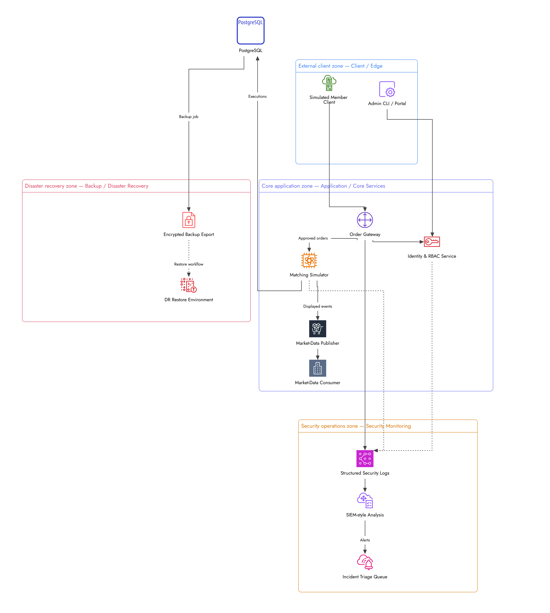

# Secure Exchange Connectivity - LAB
Self learning of an exchange connectivity lab, exploring API security, security monitoring, disaster recovery, and tenant-scope authorization.

## Why this project exists?

This project was built to demonstrate the implementations of security architecture in a system inspired by public exchnage-connectivity concepts 

## What this project demonstrates:

- Secure API design
- Tenant-scoped authorization
- Structured JSON logging
- Alert generation and triage
- Backup and restore workflow
- Security-focused documentation

## System Architecture

This diagram illustrates the major trust zones and service interactions in the lab. It demonstrates how client traffic is automated, processed, logged, monitored, and recoverable, in a segmented system. 
