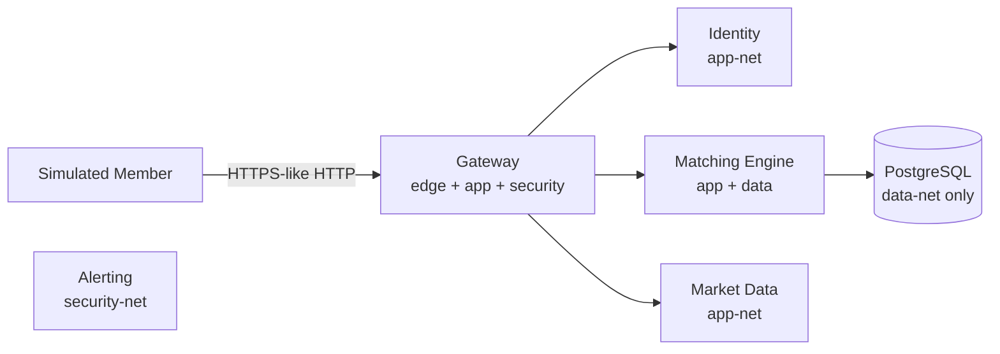

# Architecture

## Purpose

This document describes the Week 1 architecture of the **Secure Exchange Connectivity Lab**: a fictional, containerized environment for learning exchange-connectivity security concepts.

> **Disclaimer:** This is an educational reference implementation informed by publicly available exchange-connectivity concepts. It does not represent IEX Group’s internal systems, configurations, security controls, or security posture.

## System overview

Members (simulated clients) interact only with the **gateway** on `edge-net`. The gateway reaches core services on `app-net`. The **matching engine** is the only application service attached to `data-net`, where PostgreSQL lives. **Alerting** runs on `security-net` for future detection and triage work.

See also: [`diagrams/system-context.mmd`](../diagrams/system-context.mmd), [`diagrams/network-zones.mmd`](../diagrams/network-zones.mmd).

## Services (Week 2)

| Service | Role | Networks | Host exposure |
|---------|------|----------|---------------|
| `gateway` | Edge entry; JWT auth; order validation + rate limits | edge-net, app-net, security-net | `localhost:8080` |
| `identity` | Login, bcrypt passwords, JWT issuance, RBAC, append-only audit | app-net | none |
| `matching-engine` | Tenant-scoped synthetic orders (+ best-effort Postgres) | app-net, data-net | none |
| `market-data` | Market-data scaffold health | app-net | none |
| `alerting` | Detection/alerting scaffold health | security-net | none |
| `postgres` | Synthetic lab database | data-net (internal) | none |

## Trust boundaries (summary)

1. **Internet / lab host → edge-net:** untrusted synthetic member traffic terminates at the gateway.
2. **edge-net → app-net:** only the gateway bridges; members never speak directly to identity or matching.
3. **app-net → data-net:** only the matching engine may reach PostgreSQL.
4. **security-net:** monitoring/alerting plane; expanded in Week 3.

Details: [`trust-boundaries.md`](trust-boundaries.md).

## Logging

Every service emits structured JSON logs with:

`timestamp`, `actor_id`, `source_ip`, `action`, `result`, `correlation_id`

Shared helper: `services/common/logging_utils.py`.

## Out of scope for Week 2

- Detection rules and triage scripts (Week 3)
- Backup / DR restore verification (Week 4)
- In-compose TLS termination (documented in design-decisions; edge proxy model)
- Real FIX protocol or live market data (never)
