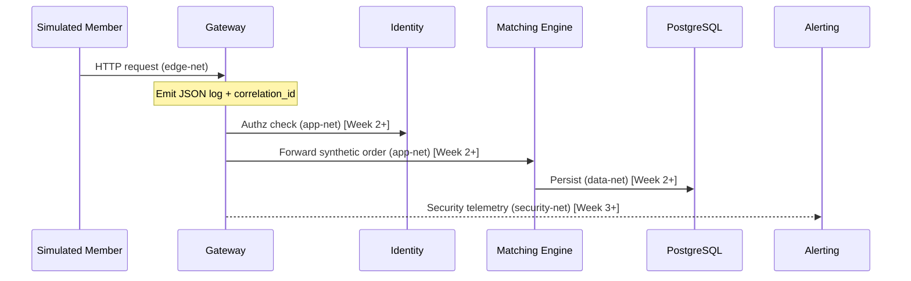

# Data Flow

## Week 1 flows

Week 1 exposes health and basic identity metadata only. Order submission and auth flows are scaffolded for later weeks but documented here so trust boundaries stay coherent.

### Health check (edge)

```text
Lab operator → host:8080/health → gateway
  → JSON log {action: health_check, result: ok, correlation_id, ...}
```

### Planned order submission (Week 2+)

```text
Member → gateway → identity (authenticate/authorize)
      → matching-engine → postgres
      → structured logs with shared correlation_id
```

### Planned alert investigation (Week 3+)

```text
Analyst → tooling/gateway → alerting
      → read correlated JSON logs / detection hits
```

### Planned DR restore (Week 4+)

```text
Operations → backup artifact → restore into DR postgres → verify row counts / checksums
```

## Diagram

Source: [`diagrams/data-flow.mmd`](../diagrams/data-flow.mmd)



## Log fields on every hop

| Field | Purpose |
|-------|---------|
| `timestamp` | UTC event time |
| `actor_id` | Who initiated (header `x-actor-id` or `anonymous`) |
| `source_ip` | Client / peer address |
| `action` | What happened |
| `result` | Outcome (`ok`, `status_200`, …) |
| `correlation_id` | Ties hops of one request together |

## Data classification (lab)

| Data | Class | Handling |
|------|-------|----------|
| Synthetic orders | Internal lab | Tenant-scoped later; never real symbols from production feeds |
| Passwords / tokens | Secret | Not logged; hashed at rest (Week 2) |
| Role catalog | Internal | `/roles` is public within app-net for Week 1 scaffolding only |
| Postgres contents | Sensitive lab | data-net only |
