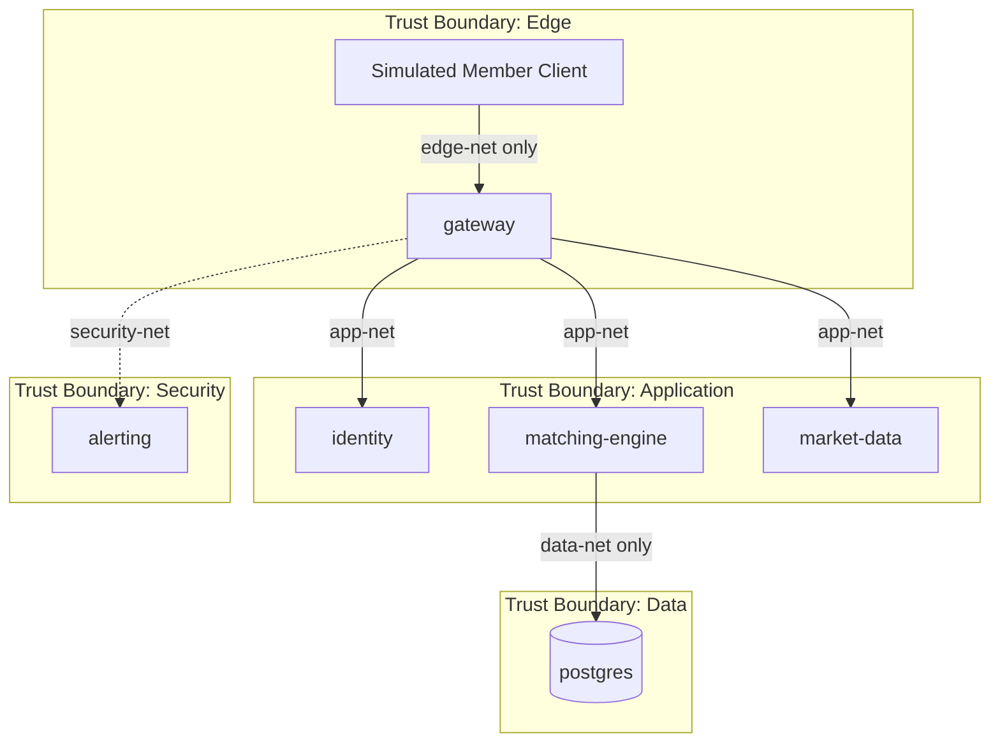

# Trust Boundaries

## Diagram

See [`diagrams/network-zones.mmd`](../diagrams/network-zones.mmd) and the embedded view below.

## Boundary definitions

| Boundary | Docker network | Who may cross | What must not cross |
|----------|----------------|---------------|---------------------|
| Edge | `edge-net` | Lab host / simulated members → `gateway` | Direct member → identity/matching/DB |
| Application | `app-net` | `gateway` ↔ identity, matching-engine, market-data | Member clients; Postgres |
| Data | `data-net` (internal) | `matching-engine` ↔ `postgres` | Gateway, identity, market-data, alerting, host |
| Security | `security-net` | `gateway` (log ship scaffold) ↔ `alerting` | Database credentials / member order payloads (future hardening) |

## Service trust summary

| Service | Trust zone | Why |
|---------|------------|-----|
| gateway | Edge + App + Security | Only published service; bridges untrusted clients to internal planes |
| identity | App | Auth decisions must not be internet-reachable |
| matching-engine | App + Data | Needs orders from app plane and persistence on data plane |
| market-data | App | Distributes synthetic data to authorized app peers |
| alerting | Security | Monitoring plane separated from trading path |
| postgres | Data | Highest-value store; internal network; no host port |

## Enforcement in Week 1

- Compose network attachments encode the boundaries.
- `data-net` is `internal: true` so Postgres has no path to the public internet.
- Only `gateway` publishes a host port (`8080`).
- Structured logs record `source_ip`, `actor_id`, and `correlation_id` at each hop for later investigation.
